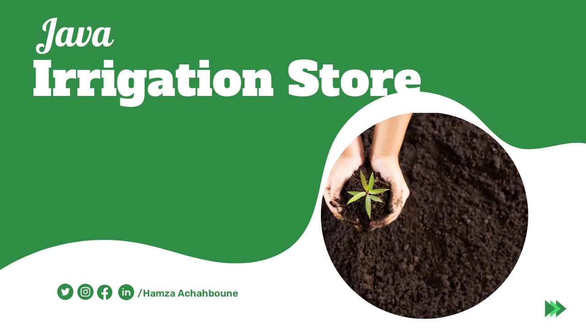

# Irrigation Store Application

## Description

The Irrigation Store Application is a desktop application built using Java Swing that allows users to manage items, create and manage sellers accounts, and process sales transactions for an irrigation store.

See Video of the application here : [Video](https://youtu.be/OPdxYNwZJe8)

## Prerequisites

To run the application, you will need the following:

- Java Development Kit (JDK) 8 or higher
- MySQL database
- IDE (NetBeans Preferable)

## Installation

1. Clone the repository to your local machine.
2. Open the project in your Java IDE of choice.
3. Update the `Hardware.db` file with your MySQL database information.
4. Build the project using your IDE's build tool or by running the command `javac *.java` in the project directory.
5. Run the application by executing the command `java Login` in the project directory.

## Usage

The application features a user-friendly interface that allows users to easily manage their inventory, customers, and sales transactions and create bills.

### Admin Management

The Admin management feature allows admin to add, view, edit, and delete products from stock.andcan also view selles and create bills also create account for sellers.

### Sellers Management

The Sellers management feature allows users to create and manage  sales. Create bill view bill information, and edit, delete or print existing Bill .

## Support

If you encounter any issues or have any questions about the application, please contact us at https://www.linkedin.com/in/achahboune-hamza/.

## Contact information :
- [Facebook](https://www.facebook.com/profile.php?id=100082569926842)
- [Twitter](https://twitter.com/HamzaAchahboun3)
- [LinkedIn](https://www.linkedin.com/in/achahboune-hamza/)
- [Redit](https://www.reddit.com/user/HamzaVerde)
- [Youtube](https://www.youtube.com/channel/UCVIOkzY9OijnUJ-daoZsXqw)

## Credits
This project was developed by Hamza Achahboune. 
